# Burp Suite Web Security Lab

<p align="center">
  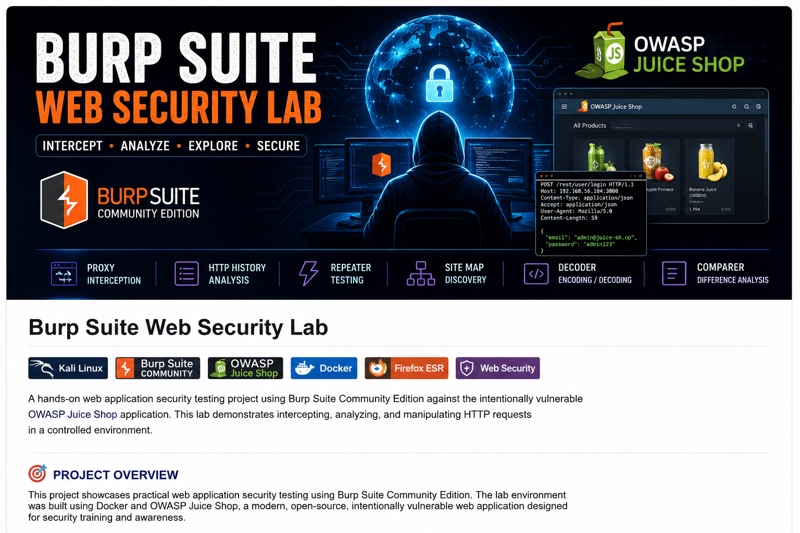
</p>

<p align="center">


</p>

---

## 📖 Overview

This repository documents my hands-on experience with **Burp Suite Community Edition** for web application security testing.

The lab environment was built using **Docker** and **OWASP Juice Shop**, an intentionally vulnerable web application designed for security training.

Throughout this project, I explored Burp Suite's core features, including intercepting HTTP traffic, inspecting requests and responses, replaying requests, comparing traffic, and encoding/decoding data.

---

# 🛠️ Lab Environment

| Component | Details |
|-----------|----------|
| Operating System | Kali Linux |
| Proxy Tool | Burp Suite Community Edition |
| Target Application | OWASP Juice Shop |
| Browser | Firefox ESR |
| Container Platform | Docker |

---

# 🎯 Objectives

- Install Burp Suite Community Edition
- Configure Firefox to use Burp Proxy
- Deploy OWASP Juice Shop using Docker
- Capture HTTP Requests
- Analyze Web Traffic
- Replay Requests using Repeater
- Explore Site Map
- Perform Base64 Encoding & Decoding
- Compare HTTP Requests

---
# 📂 Repository Structure

```text
burp-suite-web-security/
│
├── README.md
├── LICENSE
│
└── screenshots/
    ├── burp-suite-banner.png
    ├── 01-docker-pull.png
    ├── 02-docker-running.png
    ├── 03-firefox-proxy.png
    ├── 04-juice-shop-home.png
    ├── 05-http-history.png
    ├── 06-login-request.png
    ├── 07-repeater.png
    ├── 08-site-map.png
    ├── 09-base64-encode.png
    ├── 10-base64-decode.png
    └── 11-comparer.png
```

# 📷 Lab Walkthrough

## 1️⃣ Pull OWASP Juice Shop Docker Image

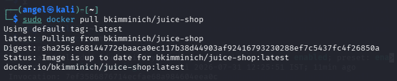

---

## 2️⃣ Run Docker Container

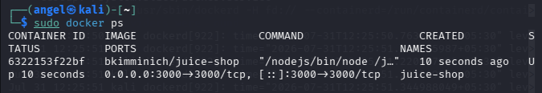

---

## 3️⃣ Configure Firefox Proxy

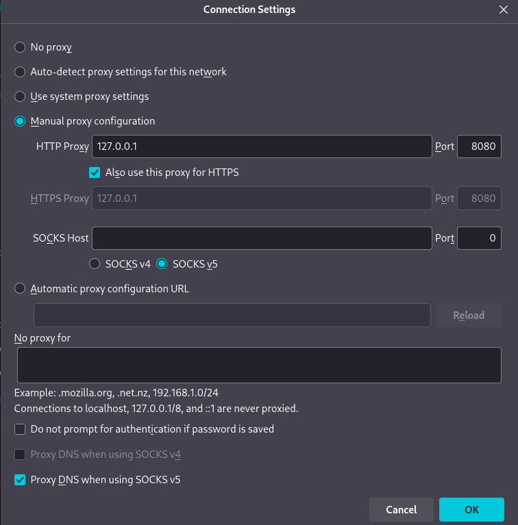

---

## 4️⃣ Launch OWASP Juice Shop

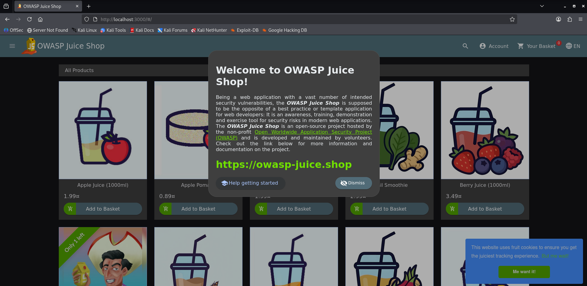

---

## 5️⃣ Capture HTTP Requests

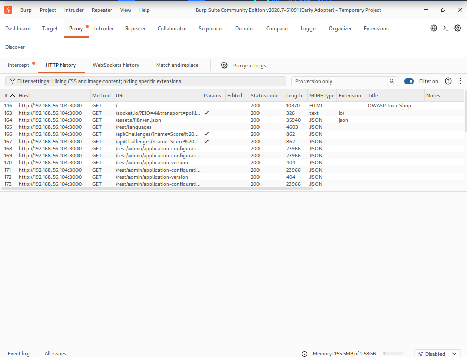

---

## 6️⃣ Capture Login Request

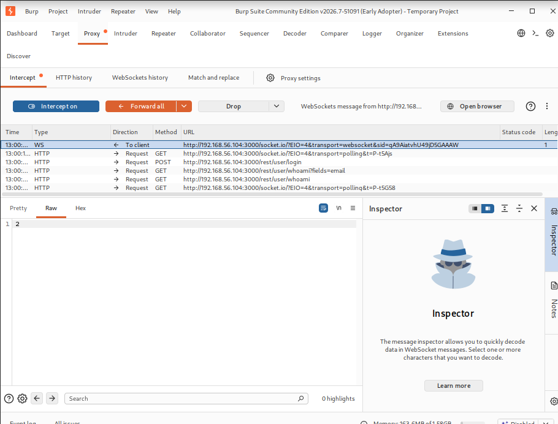

---

## 7️⃣ Replay Request using Repeater

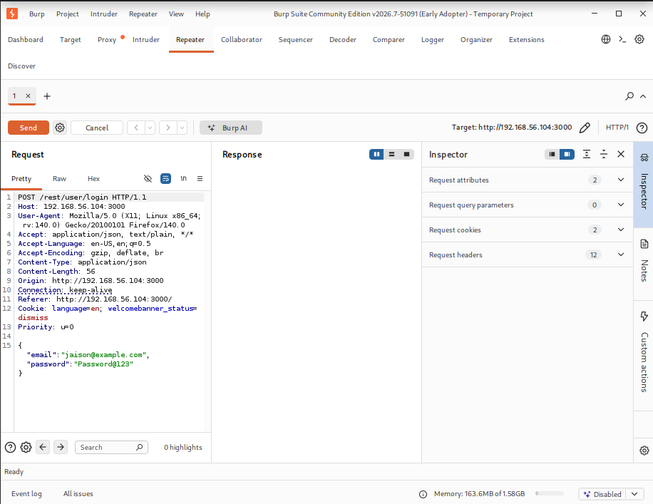

---

## 8️⃣ Explore Site Map

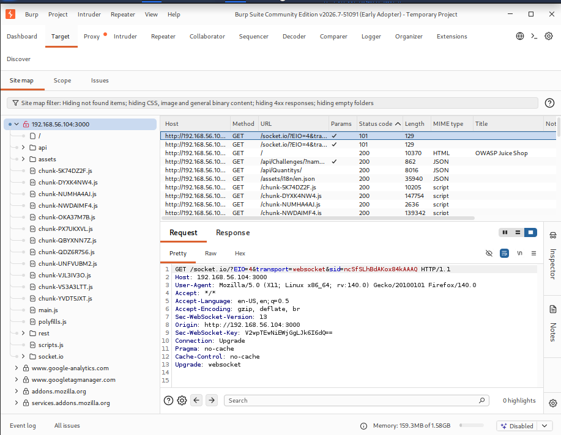

---

## 9️⃣ Base64 Encoding

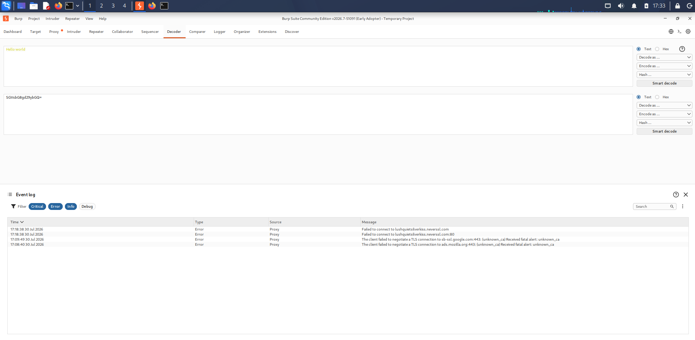

---

## 🔟 Base64 Decoding

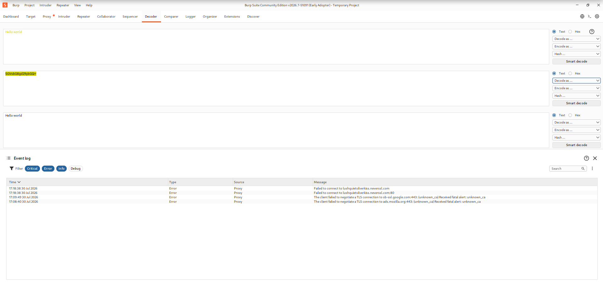

---

## 1️⃣1️⃣ Compare HTTP Requests

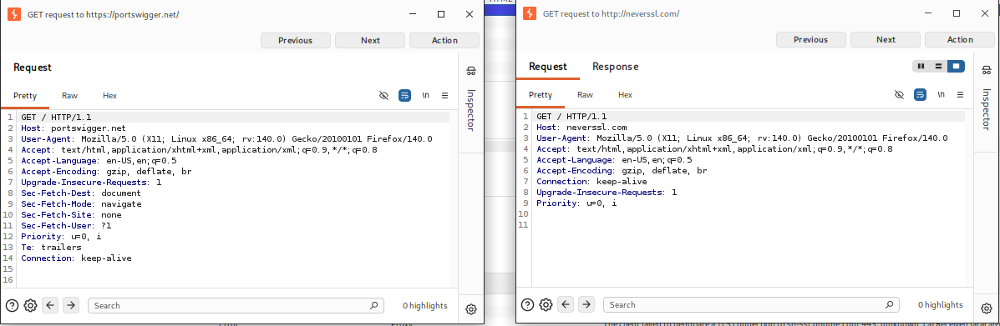

---

# 🔑 Burp Suite Features Covered

- ✅ Proxy
- ✅ HTTP History
- ✅ Site Map
- ✅ Repeater
- ✅ Decoder
- ✅ Comparer

---

# 🧰 Tools Used

- Burp Suite Community Edition
- Kali Linux
- Firefox ESR
- Docker
- OWASP Juice Shop

---

# 📚 Skills Gained

- Web Application Security Testing
- HTTP Request Analysis
- HTTP Response Analysis
- Web Proxy Configuration
- Docker Container Deployment
- Burp Suite Workflow
- Base64 Encoding & Decoding
- HTTP Traffic Inspection

---
---

# 🎓 Key Learning Outcomes

During this lab, I gained practical experience with Burp Suite Community Edition by working in a controlled environment using OWASP Juice Shop.

### Burp Suite Proxy
- Configured Firefox to route traffic through Burp Suite.
- Intercepted HTTP requests and responses.
- Observed how browsers communicate with web applications.

### HTTP History
- Captured and analyzed HTTP GET and POST requests.
- Examined request headers, response headers, cookies, and status codes.
- Identified login requests and application API calls.

### Site Map
- Explored the application's structure.
- Discovered available endpoints and resources.
- Understood how Burp automatically maps visited content.

### Repeater
- Sent captured requests multiple times.
- Modified request data safely.
- Compared server responses after changing inputs.

### Decoder
- Performed Base64 encoding and decoding.
- Understood how common encoding formats appear in web traffic.

### Comparer
- Compared multiple HTTP requests.
- Identified differences between requests.
- Learned how request comparison assists during testing.

### Docker & OWASP Juice Shop
- Pulled and ran OWASP Juice Shop using Docker.
- Verified container status and accessed the application locally.
- Used an intentionally vulnerable application for safe learning.

### Web Security Concepts
- HTTP Methods (GET, POST)
- Request Headers
- Response Headers
- Cookies
- Status Codes
- JSON Requests
- Proxy Interception
- Traffic Analysis

---

# 🚀 Future Improvements

- Perform Intruder attacks
- Explore Sequencer
- Practice Decoder with JWT Tokens
- Use Burp Extensions (BApp Store)
- Test additional OWASP Juice Shop vulnerabilities
- Practice PortSwigger Web Security Academy labs

---

# ⚠️ Disclaimer

This repository is intended for **educational purposes only**.

All testing was performed against **OWASP Juice Shop**, an intentionally vulnerable application created for learning and security awareness.

Do **not** perform these techniques against systems you do not own or have explicit permission to test.

---

# 👨‍💻 Author

**Jaison Jerald**

- GitHub: https://github.com/jaisonjerald
- LinkedIn: https://www.linkedin.com/in/jaison-jerald-79b9271b9/

---

⭐ **If you found this repository helpful, consider giving it a star!**
